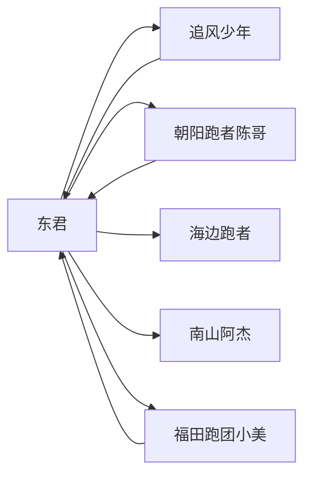

# 种子数据方案 v1.1

> 目标：生成逼真的演示数据，覆盖 App 全部功能页面，数据之间逻辑自洽。
> 本文档随实现进度持续更新。

---

## 一、总体架构

种子数据分三层：

```
┌─────────────────────────────────────────────┐
│              Layer 3: 互动数据                │
│  动态(Post)、评论、关注、收藏、排行榜          │
├─────────────────────────────────────────────┤
│              Layer 2: 跑步记录                 │
│  Run + RunSample + RunSplit + UploadRoute    │
├─────────────────────────────────────────────┤
│              Layer 1: 基础数据                │
│  User + Route + RoutePoint                   │
└─────────────────────────────────────────────┘
```

- **1 → 2 → 3** 递进依赖，低层数据生成后才能造上层
- 所有数据在地理位置上**限制在深圳范围**（北纬 22.48~22.78，东经 113.88~114.25）

---

## 二、Layer 1：基础数据

### 2.1 用户（User）

| 字段 | 数据要求 |
|------|----------|
| 数量 | 6 个种子用户 |
| ID | 固定 UUID（可在脚本之间复用） |
| Phone | 13800000001~13800000006 |
| Password | 统一 test123456 |
| Nickname | 有辨识度的昵称 |
| Gender | 1=男 / 2=女（覆盖两种性别） |
| Weight | 50~80kg（覆盖不同体型） |
| Height | 155~185cm |
| Birthday | 1980~2005 年随机 |
| TotalDistance / TotalRuns / TotalTime / TotalCalories | 根据 Layer2 跑步记录汇总更新 |
| Realm / 其他跑境字段 | 初始为 0 |

示例用户（6 人）：

| ID | 昵称 | 性别 | 体重 | 身高 | 生日 | 风格标签 |
|----|------|------|------|------|------|----------|
| seed_user_001 | 东君 | 1 (男) | 70kg | 178cm | 1985-03-15 | 全马爱好者 |
| seed_user_002 | 追风少年 | 1 (男) | 65kg | 175cm | 1999-07-22 | 速度型 |
| seed_user_003 | 朝阳跑者陈哥 | 1 (男) | 72kg | 180cm | 1988-11-03 | 晨跑党 |
| seed_user_004 | 海边跑者 | 1 (男) | 68kg | 176cm | 1992-05-18 | 海岸线控 |
| seed_user_005 | 南山阿杰 | 1 (男) | 63kg | 173cm | 2000-01-09 | 越野跑 |
| seed_user_006 | 福田跑团小美 | 2 (女) | 52kg | 162cm | 1996-09-28 | 团跑活跃 |

### 2.2 路线（Route）

#### 2.2.1 路线轨迹生成算法

每条路线需要 50~200 个坐标点，使其在地图上呈现连续、平滑的轨迹。

**生成方法**：使用三次贝塞尔曲线（Cubic Bezier）生成平滑路径。

```
P(t) = (1-t)³P₀ + 3(1-t)²t·P₁ + 3(1-t)t²·P₂ + t³·P₃, t∈[0,1]
```

对不同类型的路线，用不同的控制点策略：

| 路线类型 | 控制点策略 | 示例 |
|----------|-----------|------|
| 沿海/河岸线 | 控制点沿水域边缘弯曲排列 | 深圳湾公园海岸线 |
| 公园环路 | 控制点形成椭圆/圆角矩形 | 莲花山绕湖、笔架山环形 |
| 绿道长直线 | 控制点沿直线排列，轻微波动 | 大沙河生态长廊 |
| 越野/爬山 | 之字形控制点，海拔逐步提升 | 塘朗山越野 |
| 标准跑道 | 椭圆形控制点，闭合 | 体育场绕圈 |
| 盘山公路 | 螺旋形控制点 | 梧桐山盘山公路 |

**参数化生成步骤**（以沿海线为例）：

```
1. 定义 4~6 个贝塞尔控制点（手工选取，符合真实道路走向）
2. 在 t∈[0,1] 上按 100 等分采样
3. 每个采样点叠加 GPS 随机噪声：
   - 纬度抖动：±0.000015°（约 ±1.5m）
   - 经度抖动：±0.000015°（约 ±1.5m）
4. 计算相邻点间的 Haversine 距离 → 总距离
5. 检查总距离是否与 seed data 设定的 distance 一致，偏差 >5% 则调整采样点数
```

#### 2.2.2 海拔数据处理

| 地形类型 | 海拔范围 | 相邻点最大落差 | 随机波动 |
|----------|---------|---------------|----------|
| 海岸线/平坦 | 3~8m | 0.5m | ±0.3m |
| 公园环路 | 20~60m | 1m | ±0.5m |
| 绿道 | 5~15m | 0.8m | ±0.3m |
| 山野/越野 | 30~400m | 5m | ±1m |
| 盘山公路 | 50~680m | 8m | ±2m |

海拔变化不随机跳跃，而是沿路线**平滑过渡**（用相邻插值）。

#### 2.2.3 路线列表（共 8 条）

| # | 名称 | 类型 | 距离 (km) | 爬升 (m) | 难度 | 创建者 | 控制点个数 |
|---|------|------|-----------|---------|------|--------|-----------|
| 1 | 深圳湾公园晨跑线 | 海岸线 | 12.3 | 45 | 适中 | 东君 | 120 |
| 2 | 莲花山绕湖跑 | 公园环路 | 8.7 | 112 | 适中 | 东君 | 90 |
| 3 | 塘朗山越野训练 | 越野 | 15.4 | 420 | 困难 | 东君 | 160 |
| 4 | 笔架山公园环形 | 公园环路 | 6.5 | 85 | 容易 | 东君 | 70 |
| 5 | 大沙河绿道竞速 | 绿道 | 10.5 | 22 | 容易 | 南山阿杰 | 100 |
| 6 | 华侨城创意公路 | 街区公路 | 7.8 | 56 | 适中 | 海边跑者 | 80 |
| 7 | 人才公园5K标准线 | 公园环路 | 5.0 | 12 | 容易 | 东君 | 55 |
| 8 | 红树林滨海长廊 | 海岸线 | 14.0 | 35 | 适中 | 朝阳跑者陈哥 | 140 |

#### 2.2.4 路线统计指标逻辑校验

每条路线的数据必须满足以下约束（否则视为逻辑错误）：

```
# 距离与点数的关系
点数 × 8m ≤ 总距离 ≤ 点数 × 30m  
# 每两个相邻采样点之间 8~30m 是正常跑步步幅范围

# 配速与距离的关系
if 距离 < 5km:  配速 ≥ 4'00"/km (240秒)
if 5km ≤ 距离 < 10km: 配速 ≥ 4'30"/km (270秒)
if 10km ≤ 距离 < 全程: 配速 ≥ 5'00"/km (300秒)
if 距离 ≥ 全程: 配速 ≥ 5'30"/km (330秒)

# 配速与难度的关系
难度=容易: 配速 ≥ 5'00"/km (300秒)
难度=适中: 4'30"/km ≤ 配速 ≤ 6'30"/km
难度=困难: 配速 ≥ 5'00"/km (300秒) 且 爬升 ≥ 150m

# 心率（次/分）
有氧平均心率 = (220 - 年龄) × 0.7 ± 10
if 难度=困难: 有氧平均心率 +10
最大心率 = 有氧平均心率 + 15~25

> 东君(41岁): (220-41)×0.7=125，加 ±10 得 115~135
> 南山阿杰(26岁): (220-26)×0.7=136，加 ±10 得 126~146

# 步频（步/分）
if 配速 < 5'00"/km: 步频 ≥ 175
if 5'00"/km ≤ 配速 ≤ 6'00"/km: 步频 165~175
if 配速 > 6'00"/km: 步频 155~165

# 步幅（米）
步幅 = 60000 / (配速(秒/km) × 步频(步/分))
→ 5'00"/km, 180步/分: 60000/(300×180)=1.11m ✅ 范围0.8~1.4m

# 卡路里（千卡）
卡路里 = 体重(kg) × 距离(km) × 1.036
# 1.036 是跑步的粗略 MET 系数，后续可以更精确
```

---

## 三、Layer 2：跑步记录

### 3.1 跑步记录结构

每条 Run 记录包含：
- **Run**: 元数据（时间、距离、配速、心率等）
- **RunSample**: GPS 采样点（每 5~10 秒一个点，每条记录 50~600 个点）
- **RunSplit**: 分段数据（每公里一个 split）

### 3.2 采样点生成

基于对应路线的 RoutePoint：
```
1. 取路线 geometry 作为基础路径
2. 按比例从路线中每隔 ~10m 取一个点
3. 每个点叠加随机 GPS 偏移：
   - 幅度 ≤ 0.00005° (约5m)，模拟真实 GPS 漂移
   - 偏移方向随机（正态分布）
4. 按跑步顺序排列，时间戳间隔 = 距离间隔 / 配速
5. 心率、步频沿路线分段赋值（模拟运动中变化）
```

### 3.3 跑步模式覆盖

每条 Run 记录必须有 `mode` 字段，覆盖三种模式：

| 模式 | 英文值 | 说明 | 占比 |
|------|--------|------|------|
| 独自跑 | `solo` | 独自一人跑步，最基础的模式 | ~60% |
| 伴跑 | `companion` | 与跑友一起跑，绑定一条对手路线/对手记录 | ~25% |
| 挑战跑 | `challenge` | 挑战模式，有 challenger_id 和目标 | ~15% |

**伴跑数据要求**：
- 发起者有一条 Run 记录，`mode='companion'`
- 该 Run 关联一条 `opponent_route_id`（被伴跑的路线）
- 或者关联 `opponent_run_id`（被伴跑的某次历史记录）
- 伴跑时两条轨迹的时间戳不完全对齐（各自按实际配速采样）
- companion_runs 字段在用户表累加

**挑战跑数据要求**：
- 在 Comparison 表中有记录，关联两条 Run（挑战者和被挑战者）
- 被挑战者可以预先存在一条 Run，挑战者在相似路线跑一次
- challenges_won 字段在用户表累加

### 3.4 Run 列表（每个用户 6~12 条，共约 50 条）

| 日期范围 | 说明 |
|----------|------|
| 2026-04-01 ~ 2026-05-01 | 覆盖最近一个月的跑步记录 |
| 时间分布 | 晨跑 6:00~7:30 / 夜跑 19:00~21:00 / 周末下午 |
| 距离分布 | 3~21km，5km 和 10km 占比最多 |
| 配速分布 | 4'30"/km ~ 6'50"/km，取决于距离和难度 |
| 模式分配 | 东君至少有 1 次伴跑、1 次挑战；其他用户视情况分配 |

### 3.5 上传路线（Uploaded Routes）

上传路线是从跑步记录中提取并发布为公开路线的功能。

| 要求 | 说明 |
|------|------|
| 数量 | 每个主用户 1~2 条，共 8~12 条 |
| 数据质量 | 与路线同级别要求，不得存在轨迹稀疏、跳点等问题 |
| 轨迹来源 | 从某次 Run 的 RunSample 中提取，按 20~30m 间隔取点 |
| 元数据 | 名称、描述、标签、难度等均需填充，与 Run 中的数据一致 |
| 状态 | 上传后 status=1（已发布），略过审批流程 |
| 数据一致性 | 上传路线的 distance/elevation 与源 Run 的偏差 ≤ 3% |

上传路线的数据结构复用 Route 模型，但表名统一为 routes，通过 `creator_id` 区分。

### 3.6 逻辑校验

```
# 时长一致性
总时长 ≈ 距离 / 平均配速 × 1000  (误差 < 2%)

# Split 累加
各 split 距离之和 ≈ 总距离
各 split 时间之和 ≈ 总时长

# 采样点时序
sample_time 严格递增
start_time ≤ 所有 sample_time ≤ end_time

# 配速稳定度
相邻 km 的配速差异 ≤ 15%
（如果有 1 个 km 突然快 20% 以上，需要在该 split 标注为"冲刺"）

# 卡路里与体重关联
卡路里 = 体重 × 距离(km) × 1.036
```

#### 3.6.1 体重参与卡路里计算的改造

当前 Flutter 代码写死了体重 65kg：
```dart
final calories = (distance / 1000 * 65 * 1.036).round();
```

改造方案（待实现）：
1. 读取用户的 `Weight` 字段替代 65
2. Calories 在 finishRun 时从后端接收体重参数
3. **种子数据生成时**：按用户实际体重 × 1.036 × 距离(km) 计算卡路里，保证数据显示自洽
4. 不再加性别修正系数——卡路里公式已含个人体重，性别影响通过体重间接体现

---

## 四、Layer 3：互动数据

### 4.1 关注关系（Follow）



### 4.2 动态（Post）

| 数量 | 内容要求 |
|------|----------|
| 15~20 条 | 每条关联一条跑步记录 |
| 配图 | 显示跑步轨迹缩略图（从 RunSample 生成） |
| 文字 | 符合跑步者风格，如"周六晨刷深圳湾，微风不燥🌊" |
| 评论 | 前 3 条热门动态各带 2~3 条评论 |

### 4.3 排行榜（Leaderboard）

| # | 路线 | 条目数 |
|---|------|--------|
| 1 | 人才公园5K标准线 | 4~5 条（不同用户跑过这条线） |
| 2 | 深圳湾公园晨跑线 | 3~4 条 |
| 3 | 笔架山公园环形 | 2~3 条 |

---

## 五、实现方案

### 5.1 技术路线

**选型：Go 后端种子脚本 + SQL 直接插入**

理由：
- 现有 `seed_realistic_data.py` 是 HTTP 调 API，速度慢且依赖后端运行
- Go 种子脚本直接调用数据库层（GORM），可快速批量插入
- 贝塞尔曲线算法 Go 实现简单
- 与后端模型共享同一个 struct 定义，减少字段不匹配

**备选：纯 SQL 脚本 + 坐标点用 CSV 导入**

如果贝塞尔计算在 SQL 中太复杂，可以：
1. 用 Python/Go 生成坐标点的 CSV 文件
2. SQL 脚本导入 CSV 到 route_points
3. 用 SQL 插入 runs, run_samples

### 5.2 目录位置

```
backend/
  seed/
    seed_main.go        # 种子数据入口，顺序执行各层
    seed_users.go       # Layer 1: 用户
    seed_routes.go      # Layer 1: 路线 + 贝塞尔轨迹生成
    seed_runs.go        # Layer 2: 跑步记录 + GPS 采样生成
    seed_interact.go    # Layer 3: 关注、收藏、动态、排行榜
    seed_util.go        # 工具函数（Haversine、贝塞尔、随机数）
```

### 5.3 已有种子数据迁移

| 已有文件 | 处理方式 |
|----------|----------|
| `seed_realistic_data.py` | 弃用（改为 Go 脚本） |
| `backend/seed_realm.sql` | 保留（跑境系统独立维护） |
| `scripts/seed_route_leaderboard.sql` | 并入 Layer 3 种子脚本 |
| `lib/core/seed_data/routes_seed.dart` | 保留（Flutter demo 模式的兜底数据） |
| `lib/core/providers/seed_providers.dart` | 保留 |

### 5.4 种子数据运行方式

```bash
# 确保 MySQL 已迁移表结构
# 从项目根目录运行
cd backend && go run seed/seed_main.go

# 支持参数：
# --users-only   只创建用户
# --routes-only  只创建路线
# --clean        先清空已有种子数据再重建
```

---

## 六、未完成/待讨论事项

- [ ] 用户头像：种子用户是否需要真实头像图片？（可生成纯色圆形头像 + 首字母）
- [ ] 路线缩略图：每条路线是否需要一张缩略图（地图截图）？
- [ ] 赛季数据（跑境系统）：Realm 等级是否需要预设？
- [ ] 前端 MockRun：待种子数据就绪后，**将 `startMockRun()` 改为基于真实路线采样**
- [ ] 体重字段在前端的读取逻辑：需要改 `run_provider.dart` 的卡路里计算调用用户体重
- [ ] 国际化：种子数据的城市/地名是否需要中英双语？

### ✅ 已定事项

- [x] 跑步模式覆盖：独自跑、伴跑、挑战跑三种模式都有
- [x] 上传路线：8~12 条高质量上传路线，从 Run 中提取
- [x] 伴跑数据：绑定 opponent_route_id / opponent_run_id
- [x] 挑战数据：Comparison 表中有记录

---

## 更新日志

| 日期 | 版本 | 改动内容 |
|------|------|----------|
| 2026-05-01 | v1.0 | 初版方案，覆盖三层数据架构、路线生成算法、逻辑校验规则 |
| 2026-05-01 | v1.1 | 补充跑步模式（独自/伴跑/挑战）、上传路线要求 |

## 七、注意事项

### 7.1 数据库模型缺失字段

当前后端 `model.Run` 没有 `mode` 字段，Flutter 端 `Run` 模型有 `mode`。伴跑/挑战数据在后端通过独立的 `Challenge`、`Comparison` 表管理。

种子数据生成时需注意：
- `mode` 字段建议加入后端 Run 模型（后续迁移）
- 或种子数据设置 JSON 响应时人工写入 `mode` 值
- 伴跑数据需对应创建 Challenge + Comparison 记录

### 7.3 配速校验优先级

当多个校验规则冲突时，优先级：**难度 > 距离 > 地形**

例：人才公园5K标准线（难度=容易，距离=5km）
- 按距离规则：配速 ≤ 4'00'/km
- 按难度规则：配速 ≥ 5'00'/km
- 最终：**按难度规则**，配速取 5'00'~5'30'/km

### 7.2 账号密码

种子用户密码统一为 `test123456`，使用 `bcrypt.GenerateFromPassword()` 哈希后存入。

现有用户 `44ccc87b-871f-48b0-aed5-cd1b9c21a6cb`（东君 13332995668）的密码哈希**不可重建**，该账号不做修改。种子脚本创建新用户时需要生成新的 bcrypt hash。
